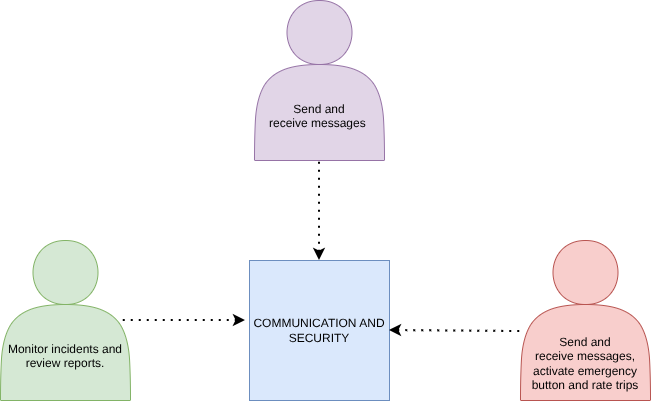
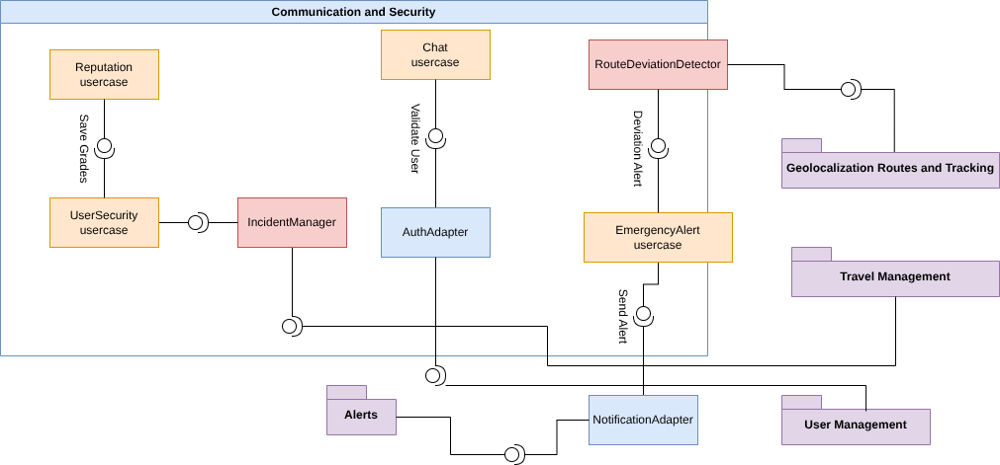
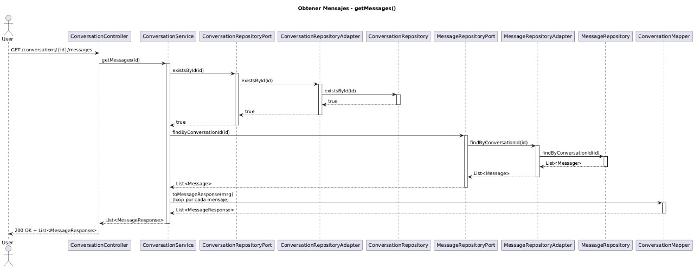
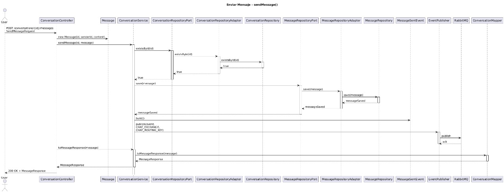
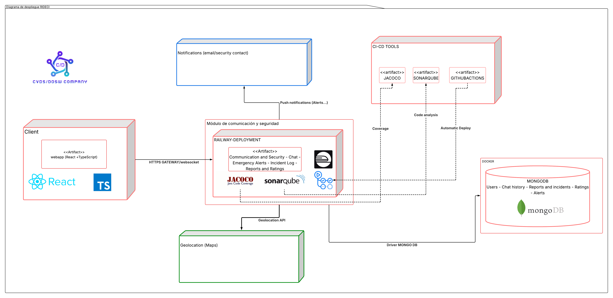

# 📌 Hades - Communication and Security
This module enables real-time communication between passengers and drivers, incident reporting, emergency handling, deviation alerts, and secure trip monitoring. It strengthens trust and safety across the RideCI ecosystem.

## 👤 Developers
- Juan Pablo Caballero
- Karol Estupiñan
- Juan Andres Suarez 
- Nicolas Andres 
- Julian Santiago Ramirez

## 📑 Content Table
1. [Project Architecture](#-project-architecture)
    - [Hexagonal Structure](#-clean---hexagonal-structure)
2. [API Documentation](#-api-endpoints)
    - [Endpoints](#-api-endpoints)
3. [Input & Output Data](#input-and-output-data)
4. [Microservices Integration](#-connections-with-other-microservices)
5. [Technologies](#technologies)
6. [Branch Strategy](#-branches-strategy--structure)
7. [System Architecture & Design](#-system-architecture--design)
8. [Getting Started](#-getting-started)
9. [Testing](#-testing)
---
## 🏢 Project Architecture
The hades - Communication and Security have an unacoplated hexagonal - clean architecture where it looks to isolate the business logic with the other part of the app dividing it into multiple components:
* **🧠 Domain (Core)**: Contains the business logic and principal rules.
* **🎯 Ports (Interfaces)**: Are interfaces that define the actions that the domain can do.
* **🔌 Adapters (Infrastructure)**: Are the implementations of the ports that connect the domain with the specific technologies.
The use of this architecture has the following benefits:
* ✔️ **Separation of Concerns:** Distinct boundaries between logic and infrastructure.
* ✔️ **Maintainability:** Easier to update or replace specific components.
* ✔️ **Scalability:** Components can evolve independently.
* ✔️ **Testability:** The domain can be tested in isolation without a database or server.
## 📂 Clean - Hexagonal Structure
```
:📂 nemesis_travel_management_backend
┣ :📂 src/
┃ ┣ :📂 main/
┃ ┃ ┣ :📂 java/
┃ ┃ ┃ ┗ :📂 edu/dosw/rideci/
┃ ┃ ┃   ┣ 📄 NemesisTravelManagementBackendApplication.java
┃ ┃ ┃   ┣ :📂 domain/
┃ ┃ ┃   ┃ ┗ :📂 model/            # 🧠 Domain models
┃ ┃ ┃   ┣ :📂 application/
┃ ┃ ┃   ┃ ┣ :📂 ports/
┃ ┃ ┃   ┃ ┃ ┣ :📂 input/          # 🎯 Input ports (Exposed use cases)
┃ ┃ ┃   ┃ ┃ ┗ :📂 output/         # 🔌 Output ports (external gateways)
┃ ┃ ┃   ┃ ┗ :📂 usecases/         # ⚙️ Use case implementations
┃ ┃ ┃   ┣ :📂 infrastructure/
┃ ┃ ┃   ┃ ┗ :📂 adapters/
┃ ┃ ┃   ┃   ┣ :📂 input/
┃ ┃ ┃   ┃   ┃ ┗ :📂 controller/   # 🌎 Input adapters (REST controllers)
┃ ┃ ┃   ┃   ┗ :📂 output/
┃ ┃ ┃   ┃     ┗ :📂 persistence/  # 🗄️ Output adapters (persistance)
┃ ┃ ┗ :📂 resources/
┃ ┃   ┗ 📄 application.properties
┣ :📂 test/
┃ ┣ :📂 java/
┃ ┃ ┗ :📂 edu/dosw/rideci/NEMESIS_TRAVEL_MANAGEMENT_BACKEND/
┃ ┃   ┗ 📄 NemesisTravelManagementBackendApplicationTests.java
┣ :📂 docs/
┃ ┣ diagramaClases.jpg
┃ ┣ diagramaDatos.jpg
┃ ┗ diagramaDespliegue.png
┣ 📄 pom.xml
┣ 📄 mvnw / mvnw.cmd
┗ 📄 README.md
```
# 📡 API Endpoints
For detailed documentation refer to our Swagger UI (Running locally at http://localhost:8080/swagger-ui.html).
## Data input & output – Conversations API

| Method | URI | Description | Request Body / Params |
| :--- | :--- | :--- | :--- |
| `POST` | `/conversations` | Creates a new conversation (chat) between participants. | `{ participants: string[], type: string, tripId: string }` |
| `GET` | `/conversations` | Retrieves all existing conversations. | — |
| `GET` | `/conversations/{id}` | Retrieves details of a specific conversation. | `id` (Path Variable) |
| `GET` | `/conversations/{id}/messages` | Retrieves all messages for a given conversation. | `id` (Path Variable) |
| `POST` | `/conversations/{id}/messages` | Sends a new message to a conversation. | `{ senderId: string, content: string }` |

## Data input & output – Emergency Alerts API

| Method | URI | Description | Request Body / Params |
| :--- | :--- | :--- | :--- |
| `POST` | `/emergencies/activate` | Activates an emergency alert for a user during a trip. | `{ userId: number, tripId: number, currentLocation: Location }` |
| `GET` | `/emergencies/{id}` | Retrieves an emergency alert by its unique identifier. | `id` (Path Variable) |
| `GET` | `/emergencies` | Retrieves all existing emergency alerts. | — |

### 📟 HTTP Status Codes
Common status codes returned by the API.
| Code | Status | Description |
| :--- | :--- | :--- |
| `200` | **OK** | Request processed successfully. |
| `201` | **Created** | Resource (Route/Tracking) created successfully. |
| `400` | **Bad Request** | Invalid coordinates or missing parameters. |
| `401` | **Unauthorized** | Missing or invalid JWT token. |
| `404` | **Not Found** | Route or Trip ID does not exist. |
| `500` | **Internal Server Error** | Unexpected error (e.g., Google Maps API failure).

# Input and Output Data
Data information per functionability
# 🔗 Connections with other Microservices
This module does not work alone. It interacts with the RideCi Ecosystem via REST APIs and Message Brokers:
1. Travel Management Module: Receives information about the travel when the travel is completed or only created.

# Technologies
The following technologies were used to build and deploy this module:
### Backend & Core


### Database

### DevOps & Infrastructure


### CI/CD & Quality Assurance


### Documentation & Testing


### Design

### Comunication & Project Management


---
# 🌿 Branches Strategy & Structure
This module follows a strict branching strategy based on Gitflow to ensure the ordered versioning,code quality and continous integration.
| **Branch**                | **Purpose**                            | **Receive of**           | **Sent to**        | **Notes**                      |
| ----------------------- | ---------------------------------------- | ----------------------- | ------------------ | ------------------------------ |
| `main`                  | 🏁 Stable code for preproduction or Production | `release/*`, `hotfix/*` | 🚀 Production      | 🔐 Protected with PR y successful CI   |
| `develop`               | 🧪 Main developing branch             | `feature/*`             | `release/*`        | ↗️ Base to continous deployment |
| `feature/*`             | ✨ New functions or refactors  to be implemented       | `develop`               | `develop`          | 🧹 Are deleted after merge to develop      |
| `release/*`             | 📦 Release preparation & final polish.      | `develop`               | `main` y `develop` | 🧪  Includes final QA. No new features added here.     |
| `bugfix/*` o `hotfix/*` | 🛠️ Critical fixes for production         | `main`                  | `main` y `develop` | ⚡ Urgent patches. Highest priority     
        |
# 🏷️ Naming Conventions
## 🌿 Branch Naming
### ✨ Feature Branches
Used for new features or non-critical improvements.
**Format:**
`feature/[shortDescription]`
**Examples:**
- `feature/authenticationModule`
- `feature/securityService`

**Rules:**
* 🧩 **Case:** strictly *camelCase* (lowercase with hyphens).
* ✍️ **Descriptive:** Short and meaningful description.

---
### 📦 Release Branches
Used for preparing a new production release. Follows [Semantic Versioning](https://semver.org/).
**Format:**
`release/v[major].[minor].[patch]`
**Examples:**
- `release/v1.0.0`
- `release/v1.1.0-beta`
---

### 🚑 Hotfix Branches
Used for urgent fixes in the production environment.
**Format:**
`hotfix/[shortDescription]`
**Examples:**
- `hotfix/fixTokenExpiration`
- `hotfix/securityPatch`
---

## 📝 Commit Message Guidelines
We follow the **[Conventional Commits](https://www.conventionalcommits.org/)** specification.

### 🧱 Standard Format
```text
<type>(<scope>): <short description>
```
# 📐 System Architecture & Design
This section provides a visual representation of the module's architecture ilustrating the base diagrams to show the application structure and components flow.

### 🧩 Context Diagram
---
The diagram shows how the RidECI Communication and Safety Module centralizes the interaction between the main actors: Driver, Passenger and Administrator. The Driver and Passenger use the module to send and receive messages, while the Passenger can activate the emergency button and rate the trip, ensuring communication and protection during the journey. The Administrator, for his part, monitors incidents and reviews security reports to make decisions and corrective actions. Together, the module integrates communication and security mechanisms, strengthening trust and protection in the platform.



### 🧩 Specific Components Diagram
---
The diagram describes the structure of the RidECI Communication and Security Module and its interaction with other microservices. The module is organized into use cases, internal components, adapters and external services, allowing you to manage critical functions such as chat, emergency alerts, incident reports and deviation detection. Use cases include security report management (UserSecurity), real-time communication (Chat) and emergency activation (EmergencyAlert). Internally, the IncidentManager records and classifies incidents, while the RouteDeviationDetector checks for route deviations and generates alerts. The AuthAdapter and NotificationAdapter adapters validate users and send external notifications, respectively. External services, such as Geolocation, Travel Management, and User Management, provide location, travel, and user information to support the operation of the module. Together, the system flow ensures that each user action is processed, validated and, in the event of incidents, managed with alerts and efficient communication.



### 🧩 Use Cases Diagram
---
The use case diagram shows the functionalities that the system offers to the different actors and how they interact with the module. The main actors are: 

Driver: You can send and receive messages with passengers, and your location is monitored for route deviations. 

Passenger: You can send and receive messages, activate the emergency button in risky situations and rate the trip at the end. 

Administrator: Monitors incidents and reports generated on the platform, making decisions or corrective actions when necessary.


### 🧩 Class Diagram
---
Based on the Specific Components diagram, we created the class diagram, where we defined an Observer design pattern that will notify all passengers already registered on the trip, allowing them to view the current location at certain intervals, and all the information about the estimated route, the distance traveled, and so on.


### 🧩 Data Base Diagram
---
This diagram represents how the data is stored, where we will find the multiple documents, and the data that will be stored in an embedded or referenced manner.


### 🧩 Sequence Diagrams
---
## 📝CHAT
The system includes three main functionalities for a conversation: creating a conversation, sending a message and obtaining messages from a conversation. These features allow two users to communicate during a trip and consult the associated chat history. Creating the conversation allows you to start a communication channel, sending messages allows interaction between participants, and obtaining messages allows you to view the complete history of what was sent.

# 💬Get messages


# 📩Send messages


# 🗨️Create Conversation


## 🚨Reports and alerts

### 🧩 Specific Deploy Diagram
---
The deployment diagram shows that the client application in React and TypeScript communicates with the system through an HTTPS/WebSocket gateway for traditional and real-time functions, while the main module runs on Railway and uses MongoDB on Docker for storage. It integrates with a geolocation service and a notifications component, and uses CI/CD tools such as GitHub Actions, Jacoco, and SonarQube to automate deployments, analyze code quality, and measure test coverage. Taken together, the diagram reflects a distributed infrastructure that connects client, backend, database, external services, and automation efficiently.



# 🚀 Getting Started
This section guides you through setting ip the project locally. This project requires **Java 17**. If you have a different version, you can change it or we recommend using **Docker** to ensure compatibility before compile.

### Clone & open repository
``` bash
git clone https://github.com/RIDECI/HADES_COMMUNICATION_SECURITY_BACKEND
```
``` bash
cd HADES_COMMUNICATION_SECURITY_BACKEND
```
You can open it on your favorite IDE

### Dockerize the project
Dockerize before compile the project avoid configuration issues and ensure environment consistency.
``` bash
docker compose up -d
```
### Install dependencies & compile project
Download dependencies and compile the source code.
``` bash
mvn clean install
```
``` bash
mvn clean compile
```
### To run the project
Start the Spring Boot server
``` bash
mvn spring-boot:run
```
# 🧪 Testing
Testing is a essential part of the project functionability, this part will show the code coverage and code quality analazing with tools like JaCoCo and SonarQube.

### 📊 Code Coverage (JaCoCo) and 🔎 Static Analysis (SonarQube)
---
[CoberturaSonarJacoco](./docs/documentos/Cobertura.pdf)
